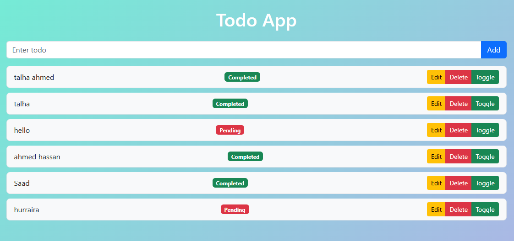

# Todo_project
"Todo App with Django REST Framework &amp; React"
# Todo Project

A **full-stack Todo App** built with **Django REST Framework** (backend) and **React.js** (frontend).  

This project demonstrates **CRUD operations** (Create, Read, Update, Delete) with a modern UI using **Bootstrap**, along with **completed/pending status toggling**.

---

## 📌 Features

- Add new todos
- Edit existing todos
- Delete todos
- Toggle complete/pending status
- Responsive UI with Bootstrap
- REST API backend using Django REST Framework
- Clear separation of **frontend** and **backend**

---

## 🖥️ Screenshots

### React Frontend



## ⚙️ Setup Instructions

### 1. Clone repository

```bash
git clone https://github.com/<your-username>/Todo_project.git
cd Todo_project
2. Setup Backend (Django)
cd todo_project
python -m venv env
# Activate virtual environment
# Windows
env\Scripts\activate
# Mac/Linux
source env/bin/activate

pip install -r requirements.txt
python manage.py migrate
python manage.py runserver
Backend will run at http://127.0.0.1:8000/
3. Setup Frontend (React)
cd todo-frontend
npm install
npm start
Frontend will run at http://localhost:3000/
📂 Project Structure
TODO_PROJECT/
├─ todo_project/       # Django backend
│  ├─ todo_project/    # Django project settings
│  ├─ todos/           # Todo app
│  └─ db.sqlite3
├─ todo-frontend/      # React frontend
└─ README.md
💡 Notes
Make sure backend is running before starting the frontend.
All API calls are made to http://127.0.0.1:8000/api/todos/
Completed items show green badge, pending items show red badge.
🎯 Future Improvements
Add user authentication
Use TailwindCSS for advanced styling
Add filtering and search functionality
Deploy project on Heroku / Vercel

---
ands do”**?
